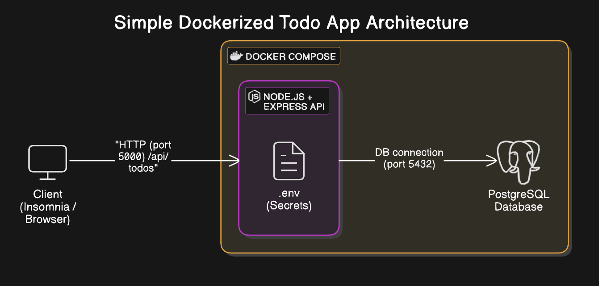

# Todo List Manager API

A containerised RESTful API built with Node.js, Express, and PostgreSQL for managing todo tasks.  
This app demonstrates modern development practices including Docker containerisation, environment variable security, and clean API architecture.

---

## Features

- Full CRUD support for todo items
- Filter todos by completed status
- Filter uncompleted todos by due date
- Uses PostgreSQL for persistent storage
- Clean RESTful API structure
- Secure use of `.env` and `.dockerignore`
- Containerised using Docker and `docker-compose`

---

## 🏗 Project Structure
todo-list-manager/
├── backend/
│ ├── controllers/
│ ├── routes/
│ ├── models/
│ ├── db/
│ ├── .env
│ ├── .dockerignore
│ ├── Dockerfile
│ └── app.js
├── .gitignore
├── .env
├── docker-compose.yml
└── README.md


---



---

##  Running the App with Docker

### 1. Clone the repo

```bash
git clone https://github.com/Coderaccangus/todo-list-manager
cd todo-list-manager
```

2. Add your environment variables
Create a .env file in the project root with the following:
PORT=5000
DB_HOST=db
DB_PORT=5432
DB_USER=postgres
DB_PASSWORD=yourpassword
DB_NAME=todos

3. Start the app
```bash
docker-compose up -d --build
```

The backend API will be available at:
http://localhost:5000/api/todos


---

## Application Architecture Explanation

This application uses Docker Compose to orchestrate two isolated containers: a backend server and a PostgreSQL database.

- **Client**: A REST client (like Insomnia or Postman) or a browser sends HTTP requests to the backend API on port `5000`.
- **Backend Container**: A Node.js + Express server receives the requests and performs CRUD operations. The backend reads environment variables securely from a `.env` file using `dotenv`, and communicates with the database using `pg`.
- **Database Container**: A PostgreSQL container listens on port `5432` and stores all todo items in a table. It is accessed internally from the backend.
- **Networking**: Docker Compose handles the internal communication between services. The backend uses the hostname `db` to connect to the database container, defined in `docker-compose.yml`.

This architecture ensures separation of concerns, scalability, and portability — making the application suitable for local development, CI/CD pipelines, or cloud deployment.

## API Endpoints

Base URL: `http://localhost:5000/api/todos`

- **GET /**  
  Retrieves all todo items.

- **GET /?completed=true**  
  Retrieves only completed todos.

- **GET /?completed=false**  
  Retrieves only uncompleted todos.

- **GET /?completed=false&due=YYYY-MM-DD**  
  Retrieves uncompleted todos with a specific due date (`YYYY-MM-DD` format).

- **GET /:id**  
  Retrieves a specific todo item by ID.

- **POST /**  
  Creates a new todo item.  
  Requires JSON body with `title`, `description`, and `due_date`.

- **PUT /:id**  
  Updates an existing todo item by ID.  
  Requires full todo object in the request body.

- **DELETE /:id**  
  Deletes a todo item by ID.
